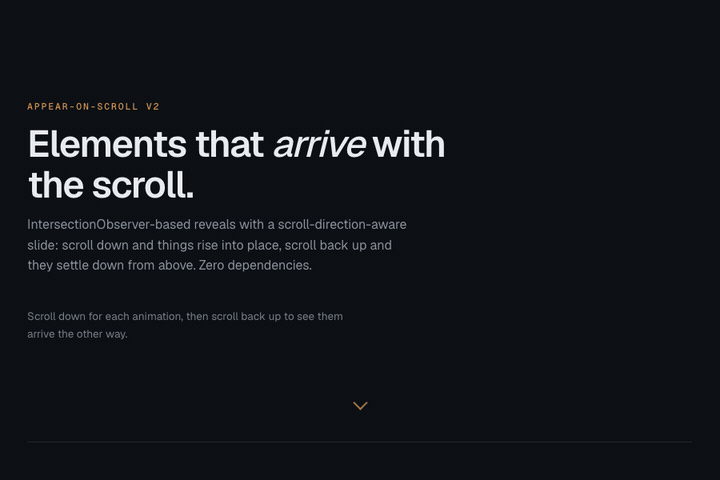

# appear-on-scroll

Reveal elements as they enter the viewport — with a slide that knows which way you're scrolling. Scroll down and elements rise into place from below; scroll back up and they settle down from above. Built on `IntersectionObserver` — zero dependencies, no per-scroll work, about 2.9 KB gzipped.

<a href="https://davemaynard.github.io/appear-on-scroll">
  
</a>

**[Try it →](https://davemaynard.github.io/appear-on-scroll)**

## Install

Version 2 is not on npm yet — `npm install appear-on-scroll` still resolves to the 1.x
line, which has a different API. Until it is published, use it from source:

```
git clone https://github.com/davemaynard/appear-on-scroll.git
cd appear-on-scroll && npm install && npm run build
```

That writes `dist/index.js` (ESM) and `dist/index.cjs`, which you can copy or link into
your project.

## Quick start

```js
import {AppearOnScroll} from 'appear-on-scroll';

new AppearOnScroll('.reveal'); // direction-aware slide + fade, the classic
```

Or with options:

```js
new AppearOnScroll('.card', {
  animation: 'slide',
  duration: 800,
  distance: '32px',
  stagger: 90,
  once: true,
});
```

No build step? Point a module script at the built file:

```html
<script type="module">
  import {AppearOnScroll} from './dist/index.js';
  new AppearOnScroll('.reveal');
</script>
```

Once 2.0.0 is on npm the same import works from a CDN as
`https://esm.sh/appear-on-scroll@2`.

**[See it running →](https://davemaynard.github.io/appear-on-scroll)** — every animation type, a stagger grid, and the replay behaviour. The page source is [`demo/index.html`](demo/index.html).

## The direction-aware slide

This is the package's personality. With the default `animation: 'slide'` and `direction: 'auto'`, each element slides in from whichever edge of the viewport it crossed: up into place when you scroll down to it, down into place when you scroll back up to it. It feels like the page is meeting you halfway.

v1 did this with a scroll listener and stylesheet swapping on every direction change. v2 does it with no scroll listener at all: the `IntersectionObserver` entry's geometry (`boundingClientRect` vs `rootBounds`) says which edge the element is crossing, and a per-element `--aos-transform-from` custom property sets the starting transform. Elements that appear fully inside the viewport (initial load, jump scrolls) fall back to the side they were last seen beyond.

## Options

`new AppearOnScroll(selector, options?)` — `selector` is any CSS selector; every option is optional.

| Option | Type | Default | Description |
|:-|:-|:-|:-|
| `animation` | `'fade' \| 'slide' \| 'zoom' \| 'blur'` | `'slide'` | How elements arrive. Every animation composes with a fade. |
| `direction` | `'auto' \| 'up' \| 'down' \| 'left' \| 'right'` | `'auto'` | Travel direction for the slide. `'auto'` follows the scroll; explicit values pin it. |
| `distance` | `string` | `'25px'` | Any CSS length the slide travels. |
| `scale` | `number` | `0.95` | Starting scale for the zoom animation. |
| `duration` | `number` | `600` | Animation length in milliseconds. |
| `delay` | `number` | `0` | Milliseconds to wait before animating. |
| `easing` | `string` | `'cubic-bezier(0.5, 0, 0, 1)'` | Any CSS easing function. |
| `stagger` | `number` | `0` | Extra milliseconds of delay per element when several appear in the same observer batch — turns a grid pop into a cascade. |
| `once` | `boolean` | `false` | When `true`, elements stay visible after their first appearance instead of replaying on re-entry. |
| `threshold` | `number \| number[]` | `0` | Passed through to `IntersectionObserver`. |
| `rootMargin` | `string` | `'0px'` | Passed through to `IntersectionObserver`. |
| `respectReducedMotion` | `boolean` | `true` | Honor `prefers-reduced-motion: reduce` (see below). |

### Reduced motion

When the user prefers reduced motion (and `respectReducedMotion` is left `true`), elements are simply visible: no initial hiding, no flash, no transition. This is handled in the injected stylesheet's `@media (prefers-reduced-motion: reduce)` block, so it applies before the first paint. Set `respectReducedMotion: false` only if the motion is essential to your content.

### Styling hooks

Elements get an `appear-on-scroll` class while managed and `appear-on-scroll--visible` once revealed, driven by one injected stylesheet built on custom properties (`--aos-duration`, `--aos-delay`, `--aos-easing`, `--aos-transform-from`, `--aos-filter-from`). Override any of them in your own CSS for per-element fine-tuning.

### destroy()

```js
const reveals = new AppearOnScroll('.reveal');
reveals.destroy();
```

Disconnects the observer, removes the library's classes and inline custom properties, and removes the injected stylesheet once the last instance is gone. Elements return to exactly how your CSS styles them.

### SSR

Importing the module never touches `window` or `document`, so it's safe in server-rendered apps. Construct instances in browser-side code (a `useEffect`, a mounted hook, a plain module script); constructing where no DOM exists is a clean no-op.

## Migrating from v1

Existing code keeps working — `new AppearOnScroll(selector, options)` with `delay`, `duration`, `easing`, `once`, `slide`, and `slideDistance` all behave as before, including the direction-aware slide as the default and `slide: false` meaning a pure fade.

What changed under the hood and around it:

- **No scroll listener.** The core is an `IntersectionObserver`; visibility math and per-scroll stylesheet swapping are gone. If you relied on the two internal `<style>` elements to override styles, target the `--aos-*` custom properties or the class names instead.
- **`slideDistance` → `distance`.** The old name still works as an alias.
- **New options**: `animation`, `direction`, `scale`, `stagger`, `threshold`, `rootMargin`, `respectReducedMotion` — and a `destroy()` method.
- **Reduced motion is respected by default** — v1 always animated.
- **Packaging**: dual ESM + CJS with a proper `exports` map and types; `import {AppearOnScroll} from 'appear-on-scroll'` works in both module systems.
- **v1 quirk dropped**: `position: fixed` elements were always treated as visible; v2 just observes them like anything else.

## Development

```
npm install
npm run build      # dual ESM/CJS + type declarations via tsup, into dist/
npm test           # builds, then runs the Playwright suite against demo/index.html
npm run typecheck  # tsc --noEmit
```

The test suite uses your installed Chrome (`channel: 'chrome'`). No Chrome? Run `npx playwright install chromium` once and it falls back to the bundled build.

## Author

**Dave Maynard** — [GitHub](https://github.com/davemaynard)
